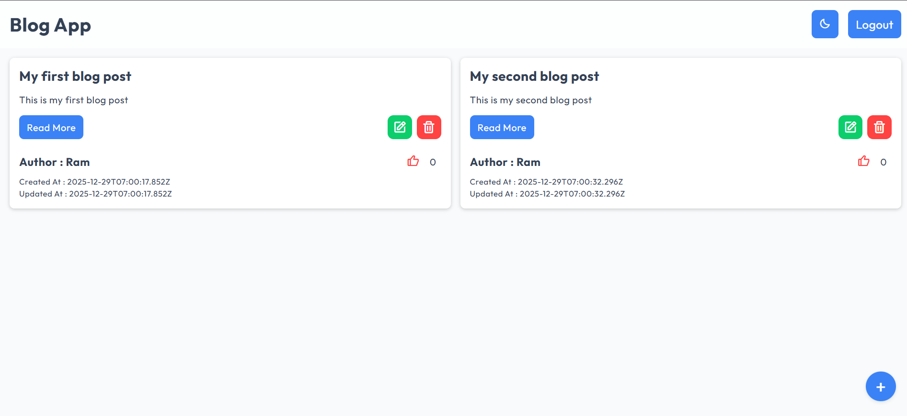
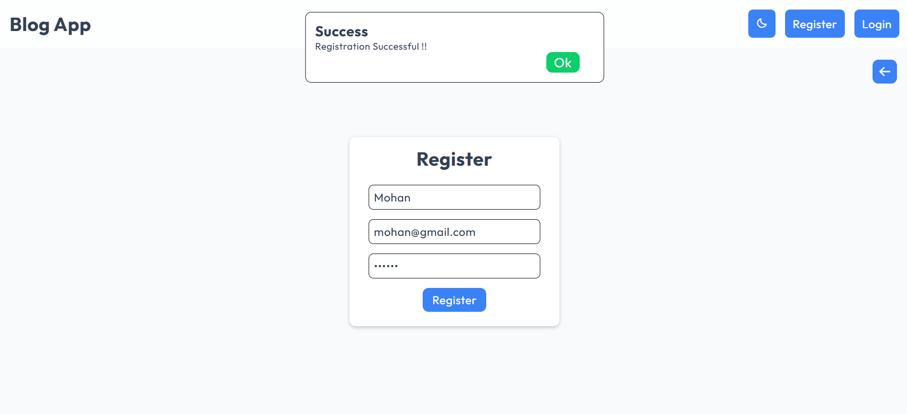
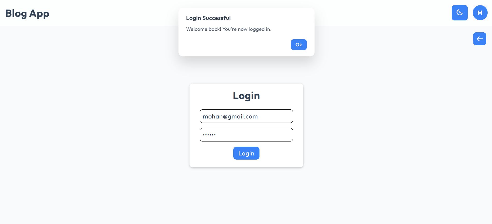
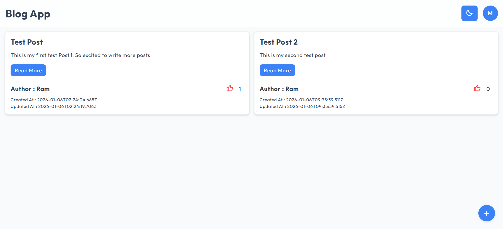
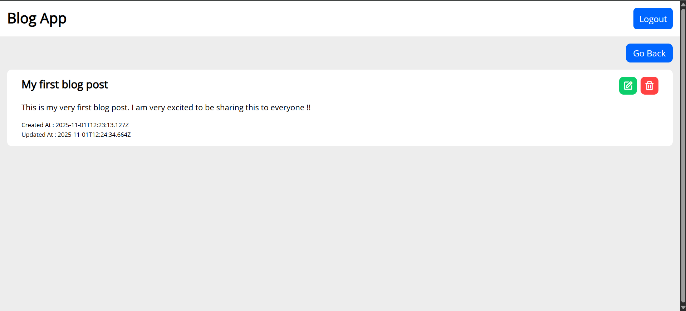
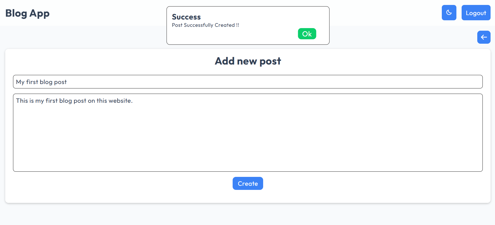
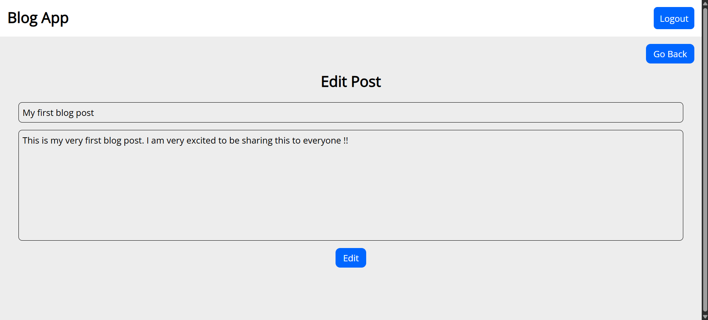
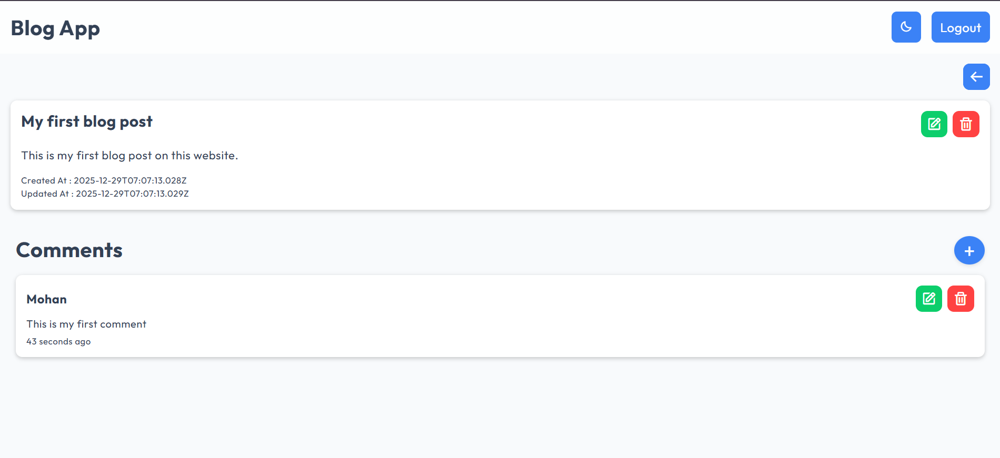
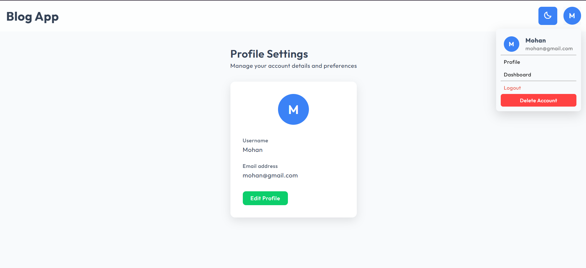
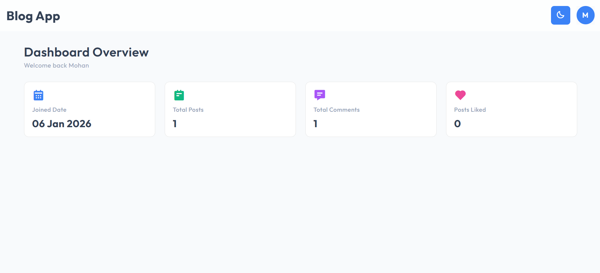

# 📝 MERN Blog App

This is a full-stack blogging application developed using the MERN stack—MongoDB, Express, React, and Node.js. It allows users to securely register and log in, create blog posts, edit existing content, and delete posts when needed.

The application implements JWT-based authentication to protect user data and restrict access to authorized actions. It also features dynamic routing for seamless navigation between pages, along with a responsive and user-friendly interface.

## 🔗 Live Site URL : [Click Here](https://vryeshwanth.github.io/Blog-Post-App/)

## 🚀 Deployment

-   **Frontend:** GitHub Pages
-   **Backend:** Render
-   **Database:** MongoDB Atlas

## 🧠 Tech Stack

-   **Frontend:** React, React Router, Context API, Axios
-   **Backend:** Node.js, Express.js
-   **Database:** MongoDB (with Mongoose)
-   **Authentication:** JSON Web Token (JWT)

## ✨ Features

-   Secure user authentication with registration and login
-   Full CRUD functionality for blog posts
-   Detailed individual post view
-   JWT based Authentication and Authorization
-   Context-based state management for posts and notifications
-   Fully Responsive User Interface
-   Support for Light and Dark themes
-   Like system for posts
-   Reusable global loader component
-   Menu dropdown for quick access to profile, dashboard and logout options
-   Account deletion option with confirmation handling

## 📁 Project Structure

```
Blog-Post-App/
├── backend/
│   ├── controllers/
│   │   ├── authController.js
│   │   ├── commentController.js
│   │   ├── dashboardController.js
│   │   ├── postController.js
│   │   └── profileController.js
│   ├── middleware/
│   │   └── authMiddleware.js
│   ├── models/
│   │   ├── Comment.js
│   │   ├── Post.js
│   │   └── User.js
│   ├── package-lock.json
│   ├── package.json
│   ├── routes/
│   │   ├── authRoutes.js
│   │   ├── commentRoutes.js
│   │   ├── dashboardRoutes.js
│   │   ├── postRoutes.js
│   │   └── profileRoutes.js
│   └── server.js
├── frontend/
│   ├── context/
│   │   ├── AuthContext.jsx
│   │   ├── LoaderContext.jsx
│   │   ├── NotificationContext.jsx
│   │   ├── PostsContext.jsx
│   │   └── ThemeContext.jsx
│   ├── eslint.config.js
│   ├── index.html
│   ├── package-lock.json
│   ├── package.json
│   ├── screenshots/
│   │   ├── AddPostPage.png
│   │   ├── Comment_Section.png
│   │   ├── EditPostPage.png
│   │   ├── HomePage.png
│   │   ├── HomePage_Login.png
│   │   ├── LoginPage.png
│   │   ├── PostDetails.png
│   │   └── RegisterPage.png
│   ├── src/
│   │   ├── App.jsx
│   │   ├── components/
│   │   │   ├── Avatar/
│   │   │   │   ├── Avatar.css
│   │   │   │   └── Avatar.jsx
│   │   │   ├── Comment/
│   │   │   │   ├── Comment.jsx
│   │   │   │   ├── CommentList.jsx
│   │   │   │   └── CommentStyles.css
│   │   │   ├── Loader/
│   │   │   │   ├── Loader.css
│   │   │   │   └── Loader.jsx
│   │   │   ├── Navbar/
│   │   │   │   ├── Navbar.css
│   │   │   │   └── Navbar.jsx
│   │   │   └── Notification/
│   │   │       ├── Notification.css
│   │   │       └── Notification.jsx
│   │   ├── main.jsx
│   │   ├── pages/
│   │   │   ├── CreatePost/
│   │   │   │   ├── CreatePost.css
│   │   │   │   └── CreatePost.jsx
│   │   │   ├── Dashboard/
│   │   │   │   ├── Dashboard.css
│   │   │   │   ├── Dashboard.jsx
│   │   │   │   └── StatisticCard.jsx
│   │   │   ├── EditPost/
│   │   │   │   ├── EditPost.css
│   │   │   │   └── EditPost.jsx
│   │   │   ├── HomePage/
│   │   │   │   ├── HomePage.css
│   │   │   │   └── HomePage.jsx
│   │   │   ├── Login/
│   │   │   │   ├── Login.css
│   │   │   │   └── Login.jsx
│   │   │   ├── PostDetails/
│   │   │   │   ├── PostDetails.css
│   │   │   │   └── PostDetails.jsx
│   │   │   ├── Profile/
│   │   │   │   ├── Profile.css
│   │   │   │   └── Profile.jsx
│   │   │   └── Register/
│   │   │       ├── Register.css
│   │   │       └── Register.jsx
│   │   ├── styles.css
│   │   └── utils/
│   │       ├── axios.js
│   │       ├── formatDate.js
│   │       └── formatTime.js
│   └── vite.config.js
└── README.md
```

## ⚙️ Setup Instructions

### 1. Clone the repository

```bash
git clone https://github.com/VRYeshwanth/Blog-Post-App.git
cd Blog-Post-App
```

### 2. Install Dependencies

### Backend

```bash
cd backend
npm install
```

### Frontend

```bash
cd frontend
npm install
```

### 3. Setup Environment Variables

### Create a `.env` file inside the `backend` folder with the following content:

```bash
PORT=3000
MONGO_URI=your_mongodb_connection_string
JWT_SECRET=your_secret_key
```

### 4. Run the Application

### Start backend server

```bash
cd backend
npm run dev
```

### Start frontend

```bash
cd frontend
npm run dev
```

The app will run on :

-   Frontend: `http://localhost:5173`
-   Backend: `http://localhost:3000`

## 🔗 API Endpoints

## 🔐 Authentication Routes

| Method | Endpoint             | Description             |
| ------ | -------------------- | ----------------------- |
| POST   | `/api/auth/register` | Register a new user     |
| POST   | `/api/auth/login`    | Log in an existing user |

## 👤 User / Profile Routes

| Method | Endpoint       | Description                                      |
| ------ | -------------- | ------------------------------------------------ |
| GET    | `/api/profile` | Get the logged-in user profile                   |
| PATCH  | `/api/profile` | Update the profile details of the logged-in user |
| DELETE | `/api/profile` | Delete the user account                          |

## 📝 Post Routes

| Method | Endpoint              | Description             |
| ------ | --------------------- | ----------------------- |
| GET    | `/api/posts`          | Fetch all posts         |
| POST   | `/api/posts`          | Create a new post       |
| PATCH  | `/api/posts/:id`      | Update an existing post |
| DELETE | `/api/posts/:id`      | Delete a post           |
| PATCH  | `/api/posts/:id/like` | Like or unlike a post   |

## 💬 Comment Routes

| Method | Endpoint                | Description                        |
| ------ | ----------------------- | ---------------------------------- |
| GET    | `/api/comments/:postId` | Fetch all comments of a given post |
| POST   | `/api/comments`         | Add a comment to a post            |
| PATCH  | `/api/comments/:id`     | Update an existing comment         |
| DELETE | `/api/comments/:id`     | Delete a comment                   |

## 📊 Dashboard Routes

| Method | Endpoint         | Description                   |
| ------ | ---------------- | ----------------------------- |
| GET    | `/api/dashboard` | Fetch dashboard overview data |

## 📸 App Preview

Here are some screenshots of the MERN Blog App in action:

### Home Page

**Before Login:**



### Register Page



### Login Page



### Home Page

**After Login:**



### Post Details



### Add Post Page



### Edit Post Page



### Comment Section



### Profile Section



### Dashboard Section



## 🤝 Contributing

Contributions are welcome!

If you'd like to improve this project:

1. Fork the repository
2. Create a new branch
3. Make your changes
4. Submit a pull request
