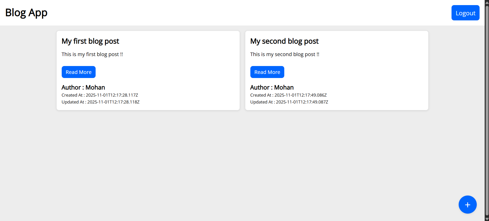

# 📝 MERN Blog App

A full-stack blogging application built using the MERN stack (MongoDB, Express, React, and Node.js). Users can register, log in, create posts, edit them, and delete them. The app also supports JWT-based authentication and dynamic routing.

## 🔗 Live Site URL : [Click Here](https://vryeshwanth.github.io/Blog-Post-App/)

## 🚀 Deployment

-   **Frontend:** GitHub Pages
-   **Backend:** Render
-   **Database:** MongoDB Atlas

## 🧠 Tech Stack

-   **Frontend:** React, React Router, Context API, Axios
-   **Backend:** Node.js, Express.js
-   **Database:** MongoDB (with Mongoose)
-   **Authentication:** JSON Web Token (JWT)

## ✨ Features

-   User registration and login
-   Create, read, edit, and delete blog posts
-   View individual post details
-   Authentication using JWT tokens
-   Context-based state management for posts and notifications
-   Responsive UI
-   Support for Light and Dark themes
-   Post like feature
-   Reusable global loader component

## 📁 Project Structure

```
Directory structure:
└── Blog-Post-App/
    ├── backend/
    │   ├── controllers/
    │   │   ├── authController.js
    │   │   ├── commentController.js
    │   │   └── postController.js
    │   ├── middleware/
    │   │   └── authMiddleware.js
    │   ├── models/
    │   │   ├── Comment.js
    │   │   ├── Post.js
    │   │   └── User.js
    │   ├── package-lock.json
    │   ├── package.json
    │   ├── routes/
    │   │   ├── authRoutes.js
    │   │   ├── commentRoutes.js
    │   │   └── postRoutes.js
    │   └── server.js
    ├── frontend/
    │   ├── context/
    │   │   ├── AuthContext.jsx
    │   │   ├── LoaderContext.jsx
    │   │   ├── NotificationContext.jsx
    │   │   ├── PostsContext.jsx
    │   │   └── ThemeContext.jsx
    │   ├── eslint.config.js
    │   ├── index.html
    │   ├── package-lock.json
    │   ├── package.json
    │   ├── screenshots/
    │   │   ├── AddPostPage.png
    │   │   ├── Comment_Section.png
    │   │   ├── EditPostPage.png
    │   │   ├── HomePage.png
    │   │   ├── HomePage_Login.png
    │   │   ├── LoginPage.png
    │   │   ├── PostDetails.png
    │   │   └── RegisterPage.png
    │   ├── src/
    │   │   ├── App.jsx
    │   │   ├── components/
    │   │   │   ├── Comment.jsx
    │   │   │   ├── CommentList.jsx
    │   │   │   ├── Loader.jsx
    │   │   │   ├── Navbar.jsx
    │   │   │   └── Notification.jsx
    │   │   ├── main.jsx
    │   │   ├── pages/
    │   │   │   ├── CreatePost.jsx
    │   │   │   ├── EditPost.jsx
    │   │   │   ├── HomePage.jsx
    │   │   │   ├── Login.jsx
    │   │   │   ├── PostDetails.jsx
    │   │   │   └── Register.jsx
    │   │   ├── styles.css
    │   │   └── utils/
    │   │       ├── axios.js
    │   │       └── formatTime.js
    │   └── vite.config.js
    └── README.md
```

## ⚙️ Setup Instructions

### 1. Clone the repository

```bash
git clone https://github.com/VRYeshwanth/Blog-Post-App.git
cd Blog-Post-App
```

### 2. Install Dependencies

### Backend

```bash
cd backend
npm install
```

### Frontend

```bash
cd frontend
npm install
```

### 3. Setup Environment Variables

### Create a `.env` file inside the `backend` folder with the following content:

```bash
PORT=3000
MONGO_URI=your_mongodb_connection_string
JWT_SECRET=your_secret_key
```

### 4. Run the Application

### Start backend server

```bash
cd backend
npm run dev
```

### Start frontend

```bash
cd frontend
npm run dev
```

The app will run on :

-   Frontend: `http://localhost:5173`
-   Backend: `http://localhost:3000`

## 🔗 API Endpoints

| Method | Endpoint           | Description         | Auth Required |
| ------ | ------------------ | ------------------- | ------------- |
| POST   | /api/auth/register | Register a new user | ❌ No         |
| POST   | /api/auth/login    | Log in a user       | ❌ No         |
| GET    | /api/posts         | Get all posts       | ❌ No         |
| GET    | /api/posts/:id     | Get post by ID      | ❌ No         |
| POST   | /api/posts         | Create new post     | ✅ Yes        |
| PATCH  | /api/posts/:id     | Edit a post         | ✅ Yes        |
| DELETE | /api/posts/:id     | Delete a post       | ✅ Yes        |

## 📸 App Preview

Here are some screenshots of the MERN Blog App in action:

### Home Page

**Before Login:**


### Register Page


### Login Page


### Home Page

**After Login:**


### Post Details


### Add Post Page


### Edit Post Page


### Comment Section


## 🤝 Contributing

Contributions are welcome!

If you'd like to improve this project:

1. Fork the repository
2. Create a new branch
3. Make your changes
4. Submit a pull request
