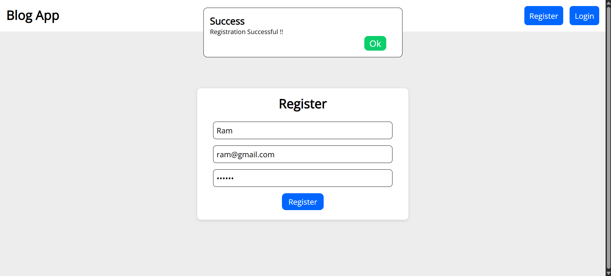

# 📝 MERN Blog App

A full-stack blogging application built using the MERN stack (MongoDB, Express, React, and Node.js). Users can register, log in, create posts, edit them, and delete them. The app also supports JWT-based authentication and dynamic routing.

## 🧠 Tech Stack

-   **Frontend:** React, React Router, Context API, Axios
-   **Backend:** Node.js, Express.js
-   **Database:** MongoDB (with Mongoose)
-   **Authentication:** JSON Web Token (JWT)

## ✨ Features

-   User registration and login
-   Create, read, edit, and delete blog posts
-   View individual post details
-   Authentication using JWT tokens
-   Context-based state management for posts and notifications
-   Responsive UI

## ⚙️ Setup Instructions

### 1. Clone the repository

```bash
git clone https://github.com/VRYeshwanth/Blog-Post-App.git
cd Blog-Post-App
```

### 2. Install Dependencies

### Backend

```bash
cd backend
npm install
```

### Frontend

```bash
cd frontend
npm install
```

### 3. Setup Environment Variables

### Create a `.env` file inside the `backend` folder with the following content:

```bash
PORT=3000
MONGO_URI=your_mongodb_connection_string
JWT_SECRET_KEY=your_secret_key
```

### 4. Run the Application

### Start backend server

```bash
cd backend
npm run dev
```

### Start frontend

```bash
cd frontend
npm run dev
```

The app will run on :

-   Frontend: `http://localhost:5173`
-   Backend: `http://localhost:3000`

## 🔗 API Endpoints

| Method | Endpoint           | Description         | Auth Required |
| ------ | ------------------ | ------------------- | ------------- |
| POST   | /api/auth/register | Register a new user | ❌ No         |
| POST   | /api/auth/login    | Log in a user       | ❌ No         |
| GET    | /api/posts         | Get all posts       | ❌ No         |
| GET    | /api/posts/:id     | Get post by ID      | ❌ No         |
| POST   | /api/posts         | Create new post     | ✅ Yes        |
| PATCH  | /api/posts/:id     | Edit a post         | ✅ Yes        |
| DELETE | /api/posts/:id     | Delete a post       | ✅ Yes        |

## 📸 App Preview

Here are some screenshots of the MERN Blog App in action:

### Home Page

**Before Login:**


### Register Page



### Login Page


### Home Page

**After Login:**


### Post Details


### Add Post Page


### Edit Post Page


## 🤝 Contributing

Contributions are welcome!  
If you'd like to improve this project:
